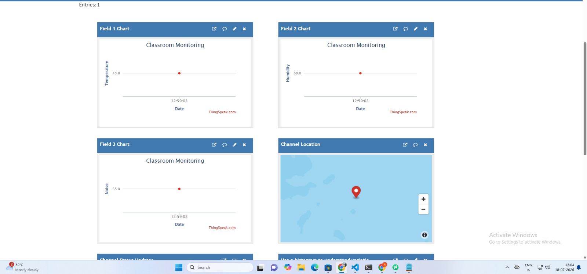
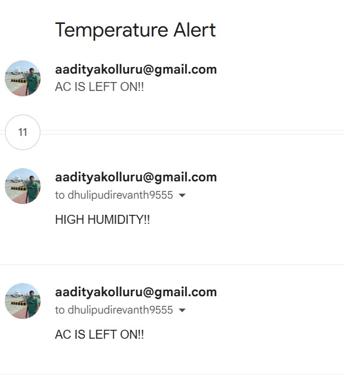

# Classroom Environmental Monitoring using SiWG917

An IoT-based classroom monitoring system using the **Silicon Labs SiWG917** wireless SoC to measure environmental parameters such as **temperature, humidity, and noise level**, and publish the collected data to a cloud-based MQTT platform for remote monitoring.

## Overview

The system periodically collects sensor data and publishes it through an **MQTT connection** to **ThingSpeak**, where it can be monitored remotely. An alert mechanism notifies the operator when predefined environmental conditions are detected.

**Parameters monitored:** Temperature · Humidity · Noise Level

## Objectives

- Monitor classroom environmental conditions in real time
- Collect sensor data using the SiWG917 dev kit's onboard sensors
- Establish Wi-Fi connectivity via the SiWG917
- Transmit sensor data using MQTT
- Store and visualize data using ThingSpeak
- Generate alerts when conditions exceed predefined thresholds

## System Architecture

```
Classroom Sensors (Temp / Humidity / Noise)
   Purpose: physically sense environmental conditions in the room
            |
            v
        SiWG917
   Purpose: acquire sensor readings, connect to Wi-Fi, and
            publish data as an MQTT client
            |
            v
   ThingSpeak MQTT Broker
   Purpose: receive published MQTT messages and route them
            into the correct channel/fields
            |
            v
   ThingSpeak Channel / Dashboard
   Purpose: store time-series data and provide built-in charts
            for temperature, humidity, and noise
            |
            v
        React
   Purpose: ThingSpeak app that watches channel data and, when
            a condition is met (temp < 15°C OR humidity > 85%),
            triggers an action — here, calling ThingHTTP
            |
            v
       ThingHTTP
   Purpose: receives the trigger from React and sends an
            outbound HTTP request
            |
            v
   Google Apps Script
   Purpose: receives the ThingHTTP request and sends the
            actual email
            |
            v
   Email Notification
   Purpose: notifies the operator (e.g. "AC IS LEFT ON!!",
            "HIGH HUMIDITY!!")
```

## Communication Protocol

```
SiWG917 --Wi-Fi--> MQTT --> ThingSpeak MQTT Broker --> ThingSpeak Channel
```

MQTT is used for its lightweight publish/subscribe model, well suited to IoT and embedded systems.

## Hardware

- Silicon Labs SiWG917 Development Kit
- Onboard temperature sensor
- Onboard humidity sensor
- Onboard microphone / noise sensing hardware
- USB connection for programming and serial monitoring

## Software and Tools

| Tool                    | Purpose                                                     |
| ----------------------- | ----------------------------------------------------------- |
| **Simplicity Studio 6** | Build, debug, and flash the SiWG917 application             |
| **WiseConnect SDK**     | Provides SiWG917 networking, sensor, and MQTT APIs          |
| **Visual Studio Code**  | Source-code editing and project management                  |
| **C**                   | Application and embedded firmware development               |
| **MQTT**                | Transfers sensor data to the cloud                          |
| **ThingSpeak**          | Cloud storage, visualization, and monitoring of sensor data |
| **Git / GitHub**        | Version control and project repository management           |


## System Workflow

1. Initialize the SiWG917 application
2. Initialize onboard sensors
3. Connect to Wi-Fi
4. Obtain network connectivity
5. Establish MQTT connection with the cloud broker
6. Read temperature, humidity, and noise measurements
7. Process sensor values
8. Publish sensor data via MQTT
9. Visualize data on ThingSpeak
10. Check values against alert conditions
11. Trigger notification if an alert condition is met
12. Repeat

## Alert System

Example condition used during development:

```
Temperature < 15 °C  AND  Humidity > 85 %
```

```
ThingSpeak --trigger--> ThingHTTP --HTTP request--> Google Apps Script --> Email Notification
```

## Data Fields

| Field   | Parameter   | Unit                 |
|---------|-------------|-----------------------|
| Field 1 | Temperature | °C                    |
| Field 2 | Humidity    | %                     |
| Field 3 | Noise Level | dB / relative level   |

Exact topic/field mapping depends on your ThingSpeak channel configuration.

## Repository Structure

```
project-root/
├── app/
│   └── app.c
├── sensors/
│   ├── temperature_sensor.c / .h
│   ├── humidity_sensor.c / .h
│   └── noise_sensor.c / .h
├── mqtt/
│   ├── mqtt_client.c / .h
├── wifi/
│   ├── wifi_app.c / .h
├── docs/
│   └── architecture.md
├── config.h.example
├── CMakeLists.txt
├── .gitignore
├── README.md
└── LICENSE
```

## Getting Started

### 1. Clone

```bash
git clone <YOUR_GITHUB_REPOSITORY_URL>
cd <PROJECT_DIRECTORY>
```

### 2. Install tools

- Simplicity Studio 6
- WiseConnect SDK
- Visual Studio Code
- SiWG917 SDK/toolchain components

### 3. Connect the board

Connect the SiWG917 dev kit via USB and verify the serial/debug interface is detected.
### 4. Configure Wi-Fi and MQTT

1. Initialize the network
2. Connect the SiWG917 to the Wi-Fi network
3. Obtain the device IP address
4. Initialize the MQTT client
5. Configure the MQTT connection parameters
6. Connect to the MQTT broker
7. Wait for the broker to confirm the connection
8. Subscribe to the required topics
9. Publish the initial MQTT message
10. Exchange MQTT messages with the broker
11. Go to `project folder -> config -> sl_net_default_values.h` and update the default Wi-Fi credentials:

```c
#ifndef DEFAULT_WIFI_CLIENT_PROFILE_SSID
#define DEFAULT_WIFI_CLIENT_PROFILE_SSID   "YOURSSID"
#endif

#ifndef DEFAULT_WIFI_CLIENT_CREDENTIAL
#define DEFAULT_WIFI_CLIENT_CREDENTIAL     "Password"
#endif
```
12. For MQTT client initialization, go to `app.c` and make the following changes:

| Parameter | Value in the Project |
|---|---|
| **Client ID** | `ORUKEDwoNSQ5JxQMLB0UIgM` |
| **Broker IP** | `18.207.44.162` |
| **Broker Port** | `1883` |
| **Clean Session** | `1` (Enabled) |
| **Last Will Topic** | `gitam/revanth/monitor/status` |
| **Last Will Message** | `{"device":"SIWG917","status":"OFFLINE"}` |
| **Published Topic** | `channels/3429057/publish` |
| **Published Message** | `field1=45&field2=60&field3=35` |
| **Publish QoS** | `0` |
| **Last Will QoS** | `1` |
| **Last Will Retained** | `1` |


`config.h` is gitignored — never commit real credentials.

### 5. Build and flash

Build using the SiWG917 toolchain, then flash the firmware to the board.


### 6. Monitor output

Expected serial output:

```
Wi-Fi client interface up Success
Wi-Fi client connected
Init MQTT client Success
MQTT broker connection started
Connected to MQTT broker
Subscribed to Topic: channels/3429057/subscribe
Published message successfully on topic: channels/3429057/publish
```
### 7. Results

**Real-time dashboard**

ThingSpeak visualizes the published temperature, humidity, and noise readings in real time, along with the channel's map location:



**Email alerts**

When an alert condition is triggered (e.g. high humidity or AC left on), the system sends an email notification via the ThingHTTP → Google Apps Script pipeline:



## Security

Never commit: Wi-Fi passwords, MQTT credentials, API keys, ThingSpeak credentials, or private certificates/keys. Keep them in `config.h` (gitignored) or environment variables.

## Future Enhancements

- Edge AI-based anomaly detection
- Automatic HVAC control
- Occupancy detection
- Adaptive sampling
- Multi-classroom / centralized dashboard
- TLS-secured MQTT
- Historical data analysis and prediction

## Applications

Smart classrooms · smart buildings · indoor air monitoring · labs · offices · libraries · industrial environments · IoT building management

## Project Highlights

| | |
|---|---|
| Platform | Silicon Labs SiWG917 |
| Connectivity | Wi-Fi |
| Protocol | MQTT |
| Cloud Platform | ThingSpeak |
| Language | C |
| Dev Environment | Simplicity Studio 6 / WiseConnect SDK |
| Parameters | Temperature, Humidity, Noise Level |

## Contributors

- Aditya Kolluru
- Revanth Dhulipudi

## License

Educational/research use. Add your preferred open-source license before making the repo public.
